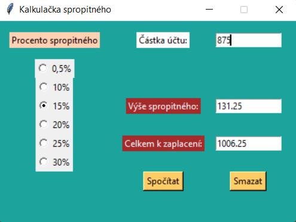

## TIP CALCULATOR
Basic GUI application for tip calculation using tkinter package. To calculate, the total amount is entered, the tip percentage is selected and the result is the tip amount and the total to be paid.

## Prinstcreen of application
